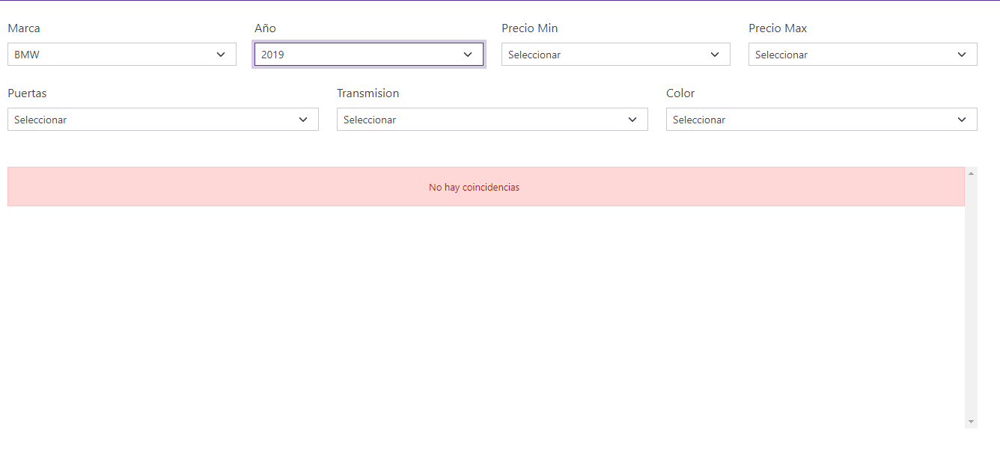

# filtros-js
Buscador con filtros usando filter js

## Comenzando 🚀

Proyecto No. 17 del curso JavaScript moderno guia Definitiva.


### Descripción 📋

Buscador de Autos:

Dado un array de objetos js ( simulando una bd )

```
const autos = [
    {
        marca: 'BMW',
        modelo:'Serie 3',
        year:2020,
        precio:325874,
        puertas:4,
        color:'negro',
        transmision:'automatico'
    },
    {
        marca: 'Nissan',
        modelo:'Serie 3',
        year:2021,
        precio:900500,
        puertas:4,
        color:'gris',
        transmision:'manual'
    }
    ]
```

se aplicaran filtros de busqueda por:

- Marca
- Año
- Precio Min
- Precio Max
- Puertas
- Transmision
- Color

Mostrando el resultado dinámico sin recargar la página.



### Herramientas 🔧

Html Bootstrap para el template, usando Pulse de https://bootswatch.com/

JavaScript puro para el manejo del DOM

Utilizando la funcion Filter para llevar acabo los diferentes filtros encadenados.
